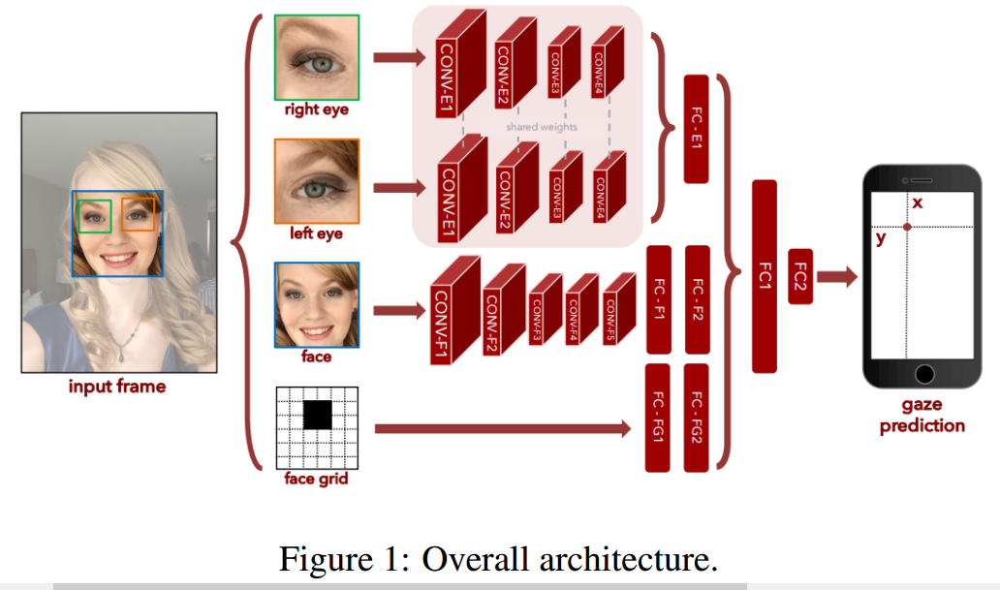

# Mobile-Eye-Gaze-Estimation-with-Deep-Learning
A four layers CNN model is designed to estimate the eye gaze or the attention 
This project is based on the four path model [1], but the datasets are modified and the model need to be tuned according to the new datasets.

[1] K.Krafka*, A. Khosla*, P. Kellnhofer, H. Kannan, S. Bhandarkar, W. Matusik and A. Torralba IEEE Conference on Computer Vision and Pattern Recognition (CVPR), 2016
